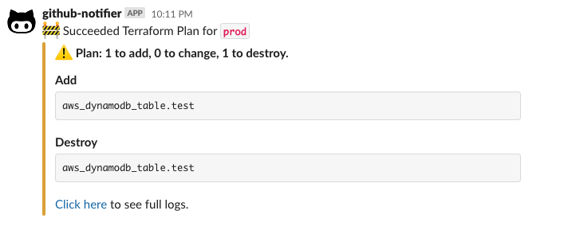

# github-terraform-plan-slack-action

GitHub Action for sending terraform plan result to a Slack channel.

- Shows summary of the affected resources
- [Click here](https://github.com/kota65535/github-terraform-plan-slack-action/actions/runs/3838277394/jobs/6534545272#step:8:56)
  link to easily jump to the full plan log



## Inputs

| Name                | Description                                   | Required | Default                                                 |
|---------------------|-----------------------------------------------|----------|---------------------------------------------------------|
| `plan-job`          | Job name where `terraform plan` has been run  | Yes      | N/A                                                     |
| `plan-step`         | Step name where `terraform plan` has been run | Yes      | N/A                                                     |
| `workspace`         | Terraform workspace name                      | No       | N/A                                                     |
| `github-token`      | GitHub token                                  | No       | `${{ env.GITHUB_TOKEN }}` or<br/> `${{ github.token }}` | 
| `channel`           | Slack channel name                            | No (*1)  | N/A                                                     | 
| `slack-bot-token`   | Slack bot token                               | No (*1)  | `${{ env.SLACK_BOT_TOKEN }}`                            | 
| `slack-webhook-url` | Slack webhook URL                             | No (*1)  | `${{ env.SLACK_WEBHOOK_URL }}`                          | 

1. Need to specify `channel` and `slack-bot-token` both or `slack-webhook-url`.

## Outputs

| Name             | Description                                                | Required | Default |
|------------------|------------------------------------------------------------|----------|---------|
| `should-apply`   | `true` if `terraform apply` is needed, otherwise `false`   | Yes      | N/A     |
| `should-refresh` | `true` if `terraform refresh` is needed, otherwise `false` | Yes      | N/A     |

## Usage

Use this action after the job where you run `terraform plan`.

```yaml

  plan:
    runs-on: ubuntu-latest
    steps:
      # ... other steps
      
      - name: Run terraform plan
        run: terraform plan

  after-plan:
    runs-on: ubuntu-latest
    needs:
      - plan
    steps:
      - name: Notify terraform plan result to the Slack channel
        uses: kota65535/github-terraform-plan-slack-action@v1
        with:
          plan-job: plan
          plan-step: Run terraform plan
          channel: my-ci
          slack-bot-token: ${{ secrets.SLACK_BOT_TOKEN }}
```
